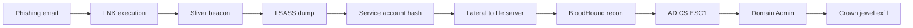

## Objetivo

Demonstrar capacidade de operar como red team em ambiente enterprise simulado: usar C2 moderno, manter OPSEC, encadear initial access + persistence + lateral + escalation + objetivo, escrever relatório estilo cliente.

## Critério de aprovação

- **1 HTB Pro Lab Red Team completo** (escolha entre Dante, RastaLabs, Offshore, Cybernetics).
- **Relatório executivo** (1-2 páginas) com narrativa em linguagem não-técnica.
- **Relatório técnico** com attack chain step-by-step + comandos + screenshots.
- **Gap analysis de detecção**: o que blue team teria visto se estivesse olhando.
- **Submissão via /sentinela** pra revisão.

## Tempo estimado: 80-150h (10-16 semanas)

Pro Lab médio leva 4-8 semanas focado. Adicione tempo pra relatórios.

## Escolha do Pro Lab

| Lab | Foco | Dificuldade | Recomendação |
|-----|------|-------------|--------------|
| **Dante** | Linux + Windows misto, network pivot | Iniciante AD | Bom primeiro |
| **RastaLabs** | Windows + AD enterprise + AppLocker | Intermediate AD + EDR-aware | **Recomendado** pra pentest real |
| **Offshore** | Full enterprise AD multi-domain, hard | Avançado AD | Substitui OSEP |
| **Cybernetics** | Multi-platform, cloud + AD + dev infra | Expert | Pra quem já tem AD sólido |
| **APTLabs** | APT-style ops, AV/EDR evasion | Expert | Tier 4-5 level |

Para checkpoint Tier 3: **RastaLabs** é o sweet spot. Cobre tudo que importa em consultoria empresarial real.

## Stack do engagement (recomendado)

```bash
# C2 framework (escolha um)
# Sliver — recomendado pra começar
curl https://sliver.sh/install | sudo bash

# OU Mythic com Apollo agent
git clone https://github.com/its-a-feature/Mythic && cd Mythic && ./mythic-cli start

# Tools complementares
pip install impacket
pipx install netexec
# certipy (AD CS)
pip install certipy-ad
# BloodHound (community edition 5.x)
docker run -p 7474:7474 -p 7687:7687 -e BLOODHOUND_PASSWORD=admin specterops/bloodhound

# Pivoting
git clone https://github.com/nicocha30/ligolo-ng
```

## Engagement methodology — sugestão

### Semana 1: Recon + Initial Access

- **External recon**: nmap + httpx + nuclei na CIDR.
- **OSINT**: profile do "company" via lab description, employee names dummy.
- **Phishing setup** (se lab permite — RastaLabs tem componente phishing): infrastructure, phishlet.
- **Initial foothold**: deliver payload, callback ao C2.

### Semana 2-3: Local privesc + Persistence

- Local privesc via SUID/sudoers/services.
- Estabelecer persistence (ao menos 2 mecanismos distintos).
- Dump local creds (LSASS, SAM, registry).

### Semana 4-5: Lateral + Domain recon

- BloodHound coleta.
- Identify path para Domain Admin.
- Lateral move via WMI/PsExec/WinRM, mantendo OPSEC.

### Semana 6-7: Domain Admin + Crown Jewel

- Path execution até DA.
- DCSync, ntds.dit dump.
- Achievement of crown jewel objective (definido por lab — geralmente file específico ou access a server).

### Semana 8: Relatórios

- Executive summary.
- Technical report.
- Gap analysis.

## Estrutura do relatório executivo (1-2 páginas)

```markdown
# Red Team Engagement — Executive Summary

**Cliente:** [empresa hipotética baseada no lab]
**Período:** YYYY-MM-DD a YYYY-MM-DD
**Equipe:** [só você, ou time]
**Escopo:** Network externo + AD interno + crown jewel objective: "[descrição]"

## Resultado em uma frase
Comprometemos o domínio CORP.LOCAL em [N] dias usando uma cadeia de [M] técnicas, alcançando [crown jewel] em [N+X] dias. O blue team detectou [X] de [Y] técnicas executadas.

## Métricas-chave
- Mean Time to Compromise (MTTC): X dias.
- Mean Time to Detection (MTTD): Y horas.
- Mean Time to Domain Admin: Z dias.

## Top 3 caminhos críticos
1. **Inicial Access via phishing PDF malicioso** → 60% dos users clicked, 30% executed.
2. **Lateral movement via service account hashing** → 1 service account spreads across 80% of network.
3. **DA escalation via AD CS misconfiguration (ESC1)** → 4 vulnerable templates.

## Top 5 recomendações (priorizadas)
1. **P0 — Disable AD CS ESC1 templates**. (Effort: 1 day)
2. **P0 — Enforce LAPS on all workstations**. (Effort: 2 weeks)
3. **P1 — Deploy detection rules for kerberoasting patterns**. (Effort: 1 week)
4. **P1 — Block macros from internet-downloaded Office files**. (Effort: 1 day, policy change)
5. **P2 — Tabletop exercise with SOC quarterly**. (Effort: ongoing)

## Próximos passos
- Validation pentest após remediação P0 (2 weeks engagement, +3 months).
- Purple team week pra detection rules (1 week, +1 month).
- Phishing awareness training rollout (ongoing).
```

## Estrutura do relatório técnico

```markdown
# Technical Report — Red Team Engagement [Lab Name]

## Methodology
[MITRE ATT&CK based. Adversary emulated: APT29 / FIN7 / generic — chose based on lab context.]

## Engagement timeline (detailed)

### Day 1 — [Date]
**Activity:** External recon
- 09:00 UTC: nmap scan of in-scope CIDR
- 09:45 UTC: nuclei scan revealed 3 internal-facing services
- 11:30 UTC: identified VPN portal with weak credential policy

**Detections expected:** Network reconnaissance (T1595) — typically not detected in default SOC config.

**Detections observed:** None.

### Day 2 — [Date]
**Activity:** Initial Access
- 10:15 UTC: phishing email delivered to 5 employees
- 11:02 UTC: employee X clicked, opened ISO, executed LNK
- 11:02 UTC: Sliver beacon callback established to attacker.com

**Detections expected:**
- T1566.001 (Phishing: Spearphishing Attachment) — email gateway.
- T1059.001 (PowerShell) — EDR script block logging.
- T1071.001 (Web Protocols C2) — proxy logs.

**Detections observed:** Email gateway logged URL click but didn't alert (categorized as benign domain).

---

[Continue dia por dia até crown jewel]

## Attack chain summary



## Findings catalog (each finding detailed):

### F-001: Vulnerable AD CS Certificate Template (ESC1)
**Severity:** Critical (CVSS 4.0: 9.3)
**Affected:** CORP-CA / EnrollAgent template
**Description:** [...]
**Reproduction:**
```bash
certipy req -u jdoe -p pass -ca CORP-CA -template EnrollAgent -upn administrator@corp.local
certipy auth -pfx administrator.pfx
```
**Impact:** Any authenticated domain user can escalate to Domain Admin.
**Remediation:** Set "Enrollee supplies subject" to false on this template.

[...]

## Detection gap analysis

| ATT&CK Tactic | Technique | Used | Detected? | Logs available | Gap |
|---------------|-----------|------|-----------|----------------|-----|
| Initial Access | T1566.001 Phishing | ✓ | ✗ | Email gateway logged | Sender domain new — should auto-flag |
| Execution | T1059.001 PowerShell | ✓ | ✗ | Script block enabled but not forwarded | Forward to SIEM, alert on encoded |
| Persistence | T1547.001 Run Keys | ✓ | ✓ | Sysmon Event 13 | EDR caught after 2h delay |
| Cred Access | T1003.001 LSASS Memory | ✓ | ✓ | EDR alerted | False positive previously — analysts ignored |
| Lateral | T1021.002 SMB Admin Shares | ✓ | ✗ | Network logs sparse | Enable SMB session logging |
| Privilege Esc | T1649 AD CS Abuse | ✓ | ✗ | No detection | Enable AD CS audit (Event 4886) |
| Exfil | T1041 Exfil over C2 | ✓ | ✓ | Proxy logged unusual outbound | Volume threshold alerted |

## Tooling & infrastructure (transparency)

- **C2**: Sliver 1.5
- **Implant**: Sliver beacon (Go), HTTP profile customizado
- **Lateral**: Impacket (wmiexec, secretsdump)
- **Recon**: BloodHound 6, Certipy 4
- **Pivoting**: Ligolo-ng

## Conclusões

[Summary of strengths in blue team, weaknesses, prioritization.]
```

## Como submeter pro /sentinela

```
tier3-checkpoint/
├── executive-summary.md           # 1-2 páginas
├── technical-report.md            # 15-30 páginas
├── attack-chain.png               # Mermaid render
├── timeline.csv                   # day-by-day
├── findings/                      # one file per F-XXX
├── detection-gaps.md              # ATT&CK matrix
├── opsec-notes.md                 # techniques tried, what worked vs detected
└── infrastructure.md              # C2, redirector, payloads used
```

Submeter via `/sentinela` pra revisão. Critérios:

- Storytelling coherent? Cliente leigo entende?
- Findings priorizados com remediation real?
- Detection gaps analysis acionável (não só "improve detection")?
- OPSEC narrative honesto (admite o que foi detectado)?
- Tone profissional, sem jargão desnecessário?

## Sinais de boa execução

Quando relatório fica bom, você vai notar:

- **Cliente lê executive summary em 5min e entende o quê fazer**.
- **Tech lead lê technical report e consegue replicar** cada step.
- **Defensor lê gap analysis e tem novo TODO list pro time**.
- **Você defenderia o relatório se cliente pedir reunião** — todas as conclusões justificáveis.

## Antes de avançar pro Tier 4

Após /sentinela retornar **PASS**, abre Tier 4 (AppSec, Code Review, Threat Modeling) — onde você foca em **prevenir** o que você acabou de aprender a explorar.

Tier 5 fecha o ciclo com AI Security + consultoria + capstone engagement completo.

## Recursos paralelos

- **Adversary Tactics: Red Team Operations** — SpecterOps training (4-day, $5k).
- **OSEP** — Offensive Security Experienced Penetration Tester (substituível por Pro Lab + writeup).
- **CRTO** (Certified Red Team Operator) — Zero Point Security (Daniel Duggan), $400, excellent.
- **CRTL** (Certified Red Team Lead) — Zero Point Security, sequel.
- **Red Team Operator** YouTube — Reece Phillips.
- **Live discord/slack communities**: HackTheBox, BloodHoundGang, RedTeamSec.
